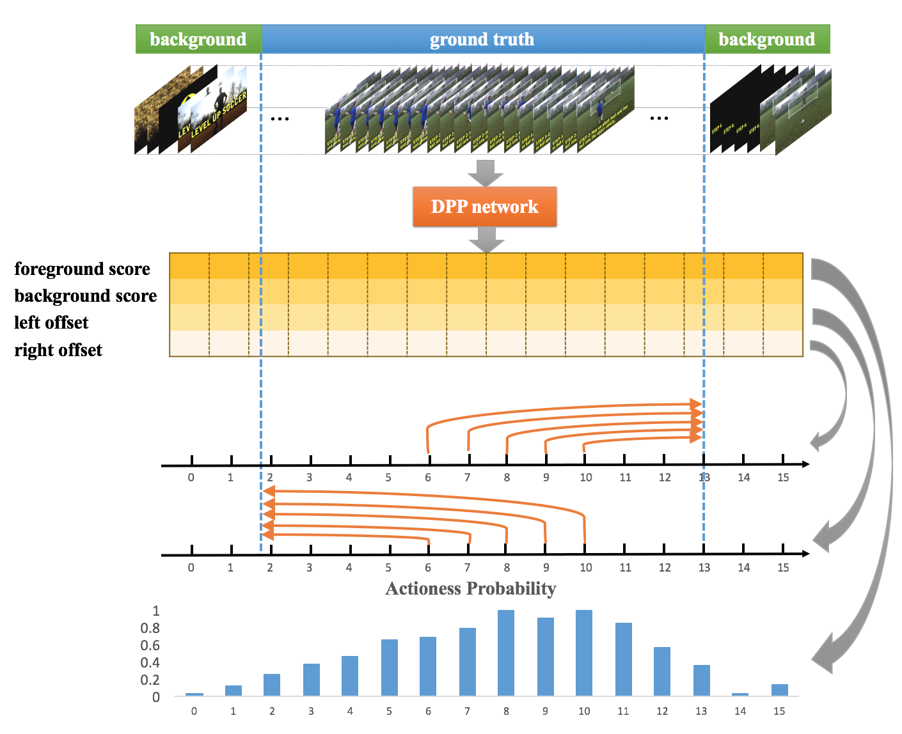

# Deep Point-wise Prediction for Action Temporal Proposal


By [Luxuan Li](https://github.com/liluxuan1997), 
[Tao Kong](http://www.taokong.org/), 
[Fuchun Sun](https://scholar.google.com/citations?user=DbviELoAAAAJ&hl=en), 
[Huaping Liu](https://sites.google.com/site/thuliuhuaping).

Pytorch implementation of the activity proposal and detection model
described in our ICONIP 2019 oral paper "Deep Point-wise Prediction for Action Temporal Proposal".


We present a simple and effective method for temporal action proposal generation, 
named Deep Point-wise Prediction (DPP). 
DPP simultaneously predicts the action existing possibility and the corresponding temporal locations, 
without the utilization of any handcrafted sliding window or grouping. 
The whole system is end-to-end trained with joint loss of temporal action proposal classification and 
location prediction.


## Architecture

<p align="center">


## Resources
We are still working on it and will release the codes soon.

## Reference
If you find our work useful, please use the following bibtex to cite our work:
```
@inproceedings{li2019dpp,
  author = {Luxuan Li, Tao Kong, Fuchun Sun and Huaping Liu},
  title = {Deep Point-wise Prediction for Action TemporalProposal},
  booktitle = {International Conference on Neural Information Processing (ICONIP)},
  year = {2019}
}
```
